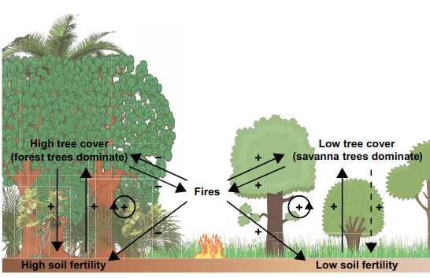
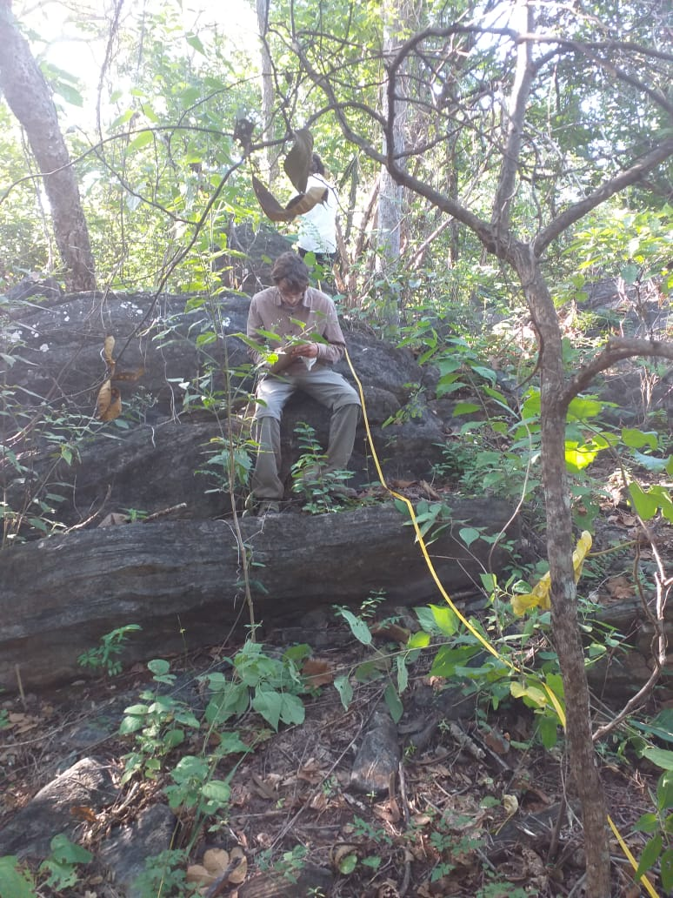
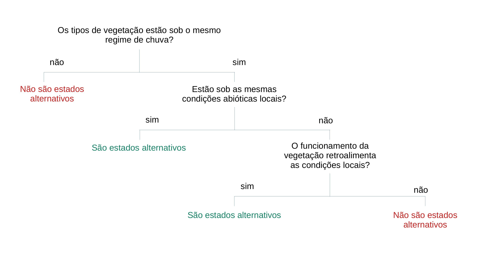
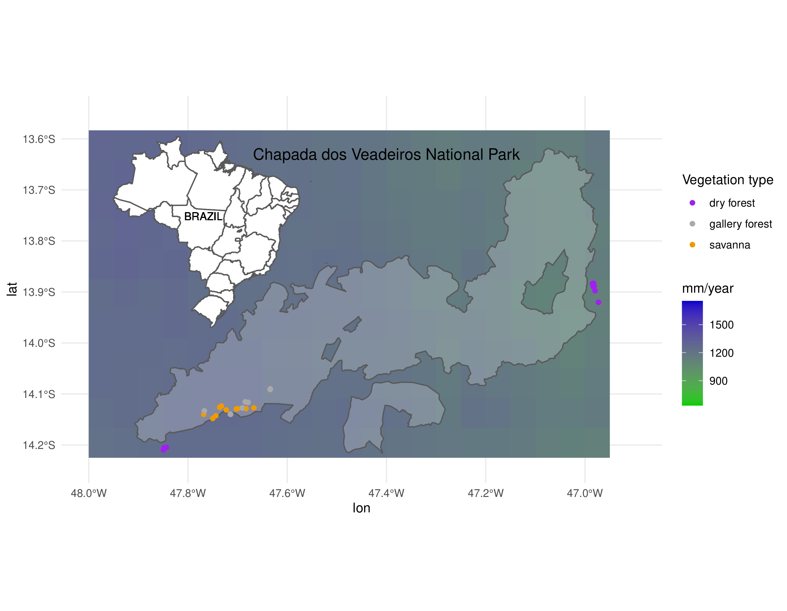
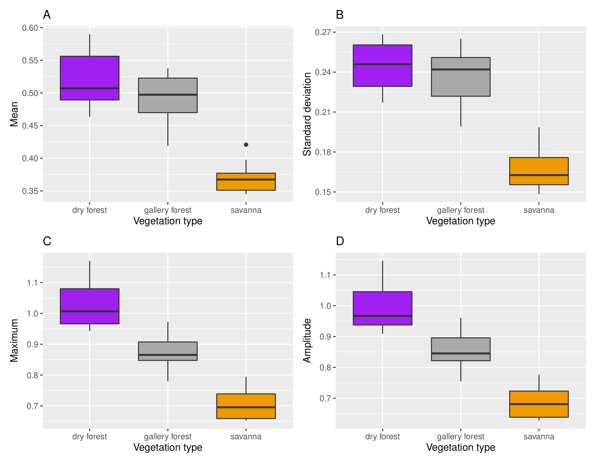
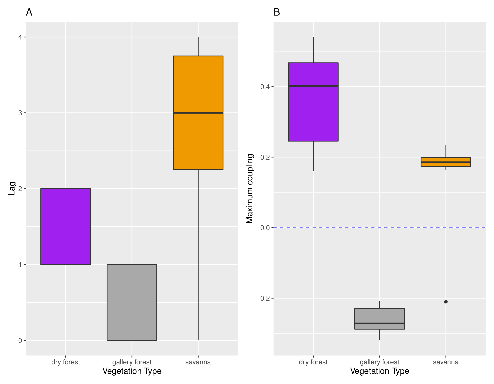
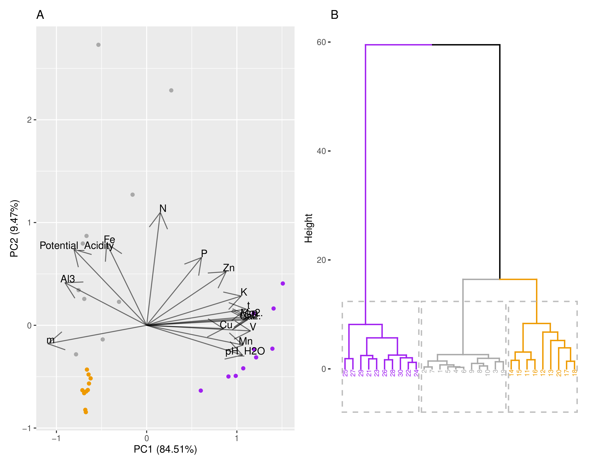
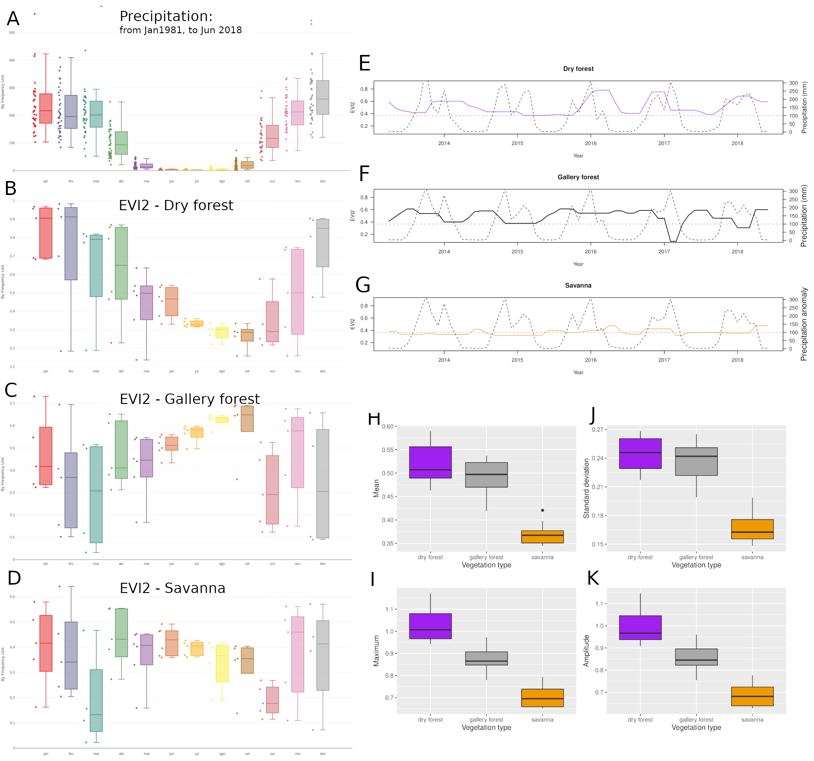

class: top, center

```{r xaringan-logo, echo=FALSE, include=TRUE}
xaringanExtra::use_logo(image_url = "https://ipes.ufsc.br/wp-content/themes/ipes-v1/images/logotipo.png")
```

```{r setup, include=FALSE}
options(htmltools.dir.version = FALSE)
```

```{r webcam, echo=FALSE, include= TRUE}
xaringanExtra::use_webcam()
```

```{r xaringan_themes, echo = FALSE, include=FALSE}
	names(xaringan:::list_css())
```

```{r broadcast, echo=FALSE}
xaringanExtra::use_broadcast()
```

## Savanas e Florestas na região tropical

São estados alternativos em relação à estrutura da vegetação (cobertura do dossel) determinados parcialmente pela PMA

```{r figure1, include=TRUE, echo=FALSE, out.width="60%", fig.align='center', fig.pos='bottom', fig.cap="Hirota et al (2011) Science"}
knitr::include_graphics("img/hirota.jpg")
```

---
class: top, left

## Sob o mesmo regime de precipitação

- __Savannas__ e __florestas__ dividem a mesma paisagem e sua distribuição é determinada pelo regime de fogo, disponibilidade de água e características do solo.

```{r, echo = FALSE, include=TRUE, fig.cap="Staal & Flores (2015) Biogeoscience", out.width="65%", fig.align='center'}

```

  *Ferreira et al (2007); Staver et al (2011); Dantas et al (2016); Veenendaal et al (2018); Pausas et al (2020)*

---

class: top, left

## Cerrado *stricto sensu*

```{r , include=TRUE, echo=FALSE, out.width="60%", fig.align='center',  fig.cap= "Cerrado stricto sensu com baixo tree cover no PNCV. Ao fundo o Morro da Baleia. Foto: MBC"}
knitr::include_graphics("img/IMG_20190416_131351.jpg")
```

---
class: top, left

## Cerrado *stricto sensu*

```{r , include=TRUE, echo=FALSE, out.width="65%", fig.align='center',  fig.cap= "Cerrado stricto sensu ao lado do Morro da Baleia no PNCV. Foto: MBC"}
knitr::include_graphics("img/IMG_20190420_103919.jpg")
```

---
class: top, left

## Cerrado *stricto sensu*

```{r , include=TRUE, echo=FALSE, out.width="65%", fig.align='center',  fig.cap= "Cerrado stricto sensu ao lado do Jardim de Maitrea, no PNCV. Foto: MBC"}
knitr::include_graphics("img/IMG_20190418_113650.jpg")
```

---
## Mata de Galeria

```{r , include=TRUE, echo=FALSE, out.width="65%", fig.align='center', fig.cap= "Mata de Galeria no Jardim de Maitrea, PNCV. Note o solo alagado. Foto: MBC"}
knitr::include_graphics("img/IMG_20190430_111056.jpg")
```

---
class: top, left

## Mata de Galeria

```{r , include=TRUE, echo=FALSE, out.width="45%", fig.align='center', fig.cap= "Mata de Galeria no Estiva, PNCV. Foto: MBC"}
knitr::include_graphics("img/IMG_20190428_152559.jpg")

```

---

## Mata de Galeria

```{r, include=TRUE, echo=FALSE, out.width="45%", fig.align='center', fig.cap= "Mata de Galeria nos Ingleses, PNCV. Foto: MBC"}
knitr::include_graphics("img/IMG_20190503_153610.jpg")
```

---

## Mas não é só isso...

--

- Além das savannas e das florestas úmidas, também existem as matas secas. 

```{r figure3567, include=TRUE, echo=FALSE, out.width="60%", fig.align='center', fig.pos='bottom', fig.cap="Dexter et al (2018) Front. Ecol. Evol."}

knitr::include_graphics("https://www.frontiersin.org/files/Articles/391790/fevo-06-00104-HTML-r1/image_m/fevo-06-00104-g001.jpg")

```

---
class: top, left

## Mata seca

- Vegetação relacionada com solos calcáreos com maior fertilidade.

```{r, include=TRUE, echo=FALSE, out.width="45%", fig.align='center', fig.cap= "Mata Seca em Nova Roma, GO. Foto: Sr Gerson (proprietário da área)"}

```

---
class: top, left

## Mata seca


```{r figure245, include=TRUE, echo=FALSE, out.width="60%", fig.align='center', fig.pos='bottom', fig.cap="Foto: Bruno Walter - EMBRAPA"}
knitr::include_graphics("https://www.embrapa.br/image/journal/article?img_id=43816247&t=1559587291923")
```

---

class: top, left

## Outra mata seca bem bonita

```{r figure247, include=TRUE, echo=FALSE, out.width="60%", fig.align='center', fig.pos='bottom', fig.cap="Foto: José Felipe Ribeiro - EMBRAPA"}
knitr::include_graphics("https://www.embrapa.br/image/journal/article?img_id=43816249&t=1559587292941")
```

---
class: top, left

## Diferentes tipos de vegetação respondem de forma diferente às perturbações.


- Os diferentes tipos de vegetação possuem composição de espécies particulares e, portanto, características funcionais diferentes;


- Por possuirem características funcionais diferentes, também interagem com o ambiente de forma diferente.

```{r, echo = FALSE, fig.align='center'}
knitr::include_graphics("https://beduka.com/blog/wp-content/uploads/2019/03/Qual-a-import%C3%A2ncia-dos-biomas-brasileiros.jpg")
```

*Charles-Dominique et al (2015); Yin et al (2014); Berdugo et al (2017); Staver et al (2020)*

---
class: top, left

# Produtividade primária como um proxy do funcionamento da vegetação

- Produção primária bruta é uma função básica para os ecossistemas e pode ser inferida por índices derivados de imagens de satélite *Biudes et al (2021)*.

```{r coisaseria, include = TRUE, echo = FALSE, out.width="70%", fig.align="center"}
knitr::include_graphics("img/biudes2021.png")
```


---
class: top, left

# Objetivo

- Testar se Cerrado stricto senso, matas de galeria e  matas secas sob um mesmo regime de precipitação são estados alternativos funcionais.

--


# Hipótese

- As fisionomias vegetais têm funcionamento diferente, mas só podem ser estados alternativos se ocorrerem nas mesmas condições locais ou se o seu funcionamento retroalimentar estas condições.

--

```{r, include=TRUE, echo=FALSE, fig.align='center', out.width="70%"}
 
```


---
class: top, left

# Métodos
*** Local do estudo***

- Diferentes tipos de vegetação coexistindo na mesma paisagem e sob o mesmo regime de chuvas.

```{r fig1, include=TRUE, echo=FALSE, out.width="85%", fig.align='center'}

```

---

class: top, left

# Métodos

**Obtenção dos *Dados de campo***

- 10 parcelas em cada fitofisionomia;

- cada uma com 200 m²;

- Coleta de solo.

```{r}

```


---

class: top, left

# Métodos

**Obtenção dos *Dados remotos***

- Landsat 8 OLI (Abril 2013 - Junho 2018) <https:www.earthexplorer.usgs.gov>

--

- CHIRPS (mesmo período) <https://data.chc.ucsb.edu/products/CHIRPS-2.0/>.

---
class: top, left

# Métodos

**Análises**

- Acoplamento = Correlação de Kendall entre chuva média mensal e EVI2 médio mensal; 

- Magnitude do acoplamento = valor absoluto do acoplamento (*sem o sinal*);

- Cálculo das respostas da vegetação (acoplamento) *com atraso* (**lag**) de zero a seis meses;

--

- PCA para reduzir variáveis do solo em duas dimensões;

--

- Regressão linear simples: Acoplamento ~ atributos do solo/PC1;

--

- Teste de Kruskal-Wallis e teste a posteriori de Nemenyi para testar diferenças entre as fitofisionomias.

---
class: top, left

# Resultados

**Estatística descritiva do EVI2**

```{r fig3, include=TRUE, echo=FALSE, out.width="85%", fig.align='center'}

```

---
class: top, left

# Resultados

**Acoplamento e atraso na resposta**

```{r fig4, include=TRUE, echo=FALSE, out.width="85%", fig.align='center'}

```

---
class: top, left

# Resultados

**Biomas agrupados por composição do solo**

```{r fig5, include=TRUE, echo=FALSE, out.width="85%", fig.align='center'}

```

---
class: top, left 

# Discussão

## Respostas às flutuações na precipitação

- Mata de galeria diminui o greenness na estação chuvosa;

```{r}
knitr::include_graphics()
```


---

- Savanna não é sensível à diminuição da precipitação durante a estação seca;

- Mata seca passa mais sede que as outras vegetações.

---
class: top, left

# Discussão

## Implicações pra transição dos biomas: estabilidade e resiliência

- Quem pode avançar sobre quem?

---

```{r out.width='50%', fig.height=6, eval=require('leaflet'), include=TRUE, echo=FALSE, fig.align='center'}
library(leaflet)
leaflet() %>% addTiles() %>% setView(-47.4, -14.0285, zoom = 9)
```

---
class: top, center

# Resultados extras

## Comportamento da série temporal de EVI2 e precipitação

```{r fig2, include=TRUE, echo=FALSE, out.width="75%", fig.align='center'}

```

---
# Agradecimentos
- 
-
-
-