class: top, left

```{r xaringan-logo, echo=FALSE, include=TRUE}
xaringanExtra::use_logo(image_url = "https://ipes.ufsc.br/wp-content/themes/ipes-v1/images/logotipo.png")
```

```{r setup, include=FALSE}
options(htmltools.dir.version = FALSE)
```

```{r webcam, echo=FALSE, include= TRUE}
xaringanExtra::use_webcam()
```

```{r xaringan_themes, echo = FALSE, include=FALSE}
	names(xaringan:::list_css())
```

```{r broadcast, echo=FALSE}
xaringanExtra::use_broadcast()
```
## Estados alternativos funcionais, mecanismos de feedback e resiliência da vegetação tropical

**OBJETIVO GERAL:** A tese tem por objetivo geral entender a <i> <u >resiliência </i> </u> da vegetação neotropical à mudanças nos regimes de chuva com base na funcionalidade da vegetação.

--
## Organização da tese

Cap I. Entender a relação dos atributos funcionais da vegetação neotropical com os mechanismos de feedbacks que governam a dinâmica de florestas e savannas.

Cap II. Testar se florestas e savannas são estados alternativos funcionais <u> sob o mesmo regime de precipitação. </u> (Escala da paisagem)

Cap III. Testar se florestas e savannas são estados alternativos funcionais <u> ao longo de um gradiente de sazonalidade. </u> (Escala continental)
---
## Estados alternativos funcionais, mecanismos de feedback e resiliência da vegetação tropical

**OBJETIVO GERAL**: A tese tem por objetivo geral entender a <u> <i> resiliência </u> </i> da vegetação neotropical à mudanças nos regimes de chuva com base na funcionalidade da vegetação.

## Organização da tese

Cap I. Entender a relação dos atributos funcionais da vegetação neotropical com os mechanismos de feedbacks que governam a dinâmica de florestas e savannas.

**Cap II. Testar se florestas e savannas são estados alternativos funcionais <u> sob o mesmo regime de precipitação. </u> (Escala da paisagem)**

Cap III. Testar se florestas e savannas são estados alternativos funcionais <u> ao longo de um gradiente de sazonalidade. </u> (Escala continental)

---
# Resiliência ecológica

- Conceito (*Holling 1973 - Annual Review of Ecology and Systematics*)

- Supõe a existência de estados alternativos de funcionamento

- Variável de estado funcional, não estrutural.


.center[

]
---

## Savanas e Florestas na região tropical

- São estados alternativos em termos de estrutura da vegetação (cobertura do dossel) determinados parcialmente pela PMA (*Hirota et al 2011 - Science*). 

```{r figure1, include=TRUE, echo=FALSE, out.width="60%", fig.align='center', fig.pos='bottom', fig.cap="Hirota et al (2011) Science"}
knitr::include_graphics("img/hirota.jpg")
```
---
class: top, left
# Sob o mesmo regime de precipitação

- __Savannas__ e __florestas__ dividem a mesma paisagem e sua distribuição é determinada pelo regime de fogo, disponibilidade de água e características do solo.

```{r, echo = FALSE, include=TRUE, fig.cap="Staal & Flores (2015) Biogeoscience", out.width="45%", fig.align='center'}
knitr::include_graphics("img/staalflores.png")
```

  *Ferreira et al (2007); Dantas et al (2016); Veenendaal et al (2018); Pausas et al (2020); Bernardino et al (2021)*

---
class: top, center

# Estrutura *vs*  funcionalidade

- Estudos sugerem que o funcionamento da vegetação seja correspondente à estrutura. (*Dantas et al 2015; Xu et al 2016; Bernardino et al 2021*)

- Florestas e savannas são estados alternativos funcionais controlados por fogo (Área basal, BT, SLA, WD,  como proxy da funcionalidade) (*Dantas et al 2015; Bernardino et al 2021*).


.center[
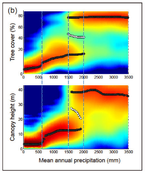
__
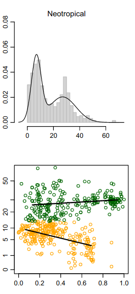
]

---
class: top, left

## Cerrado *stricto sensu*

- A cobertura do dossel varia de 5 a 60%

- Presença de gramíneas


                                    Fotos de MBC (2019)
                  

---
class: top, left

## Mata de Galeria


Fotos de MBC (2019)


---

## Mas não é só isso...

--

- Além das savannas e das florestas úmidas, também existem as matas secas. 

```{r figure3567, include=TRUE, echo=FALSE, out.width="60%", fig.align='center', fig.pos='bottom', fig.cap="Dexter et al (2018) Front. Ecol. Evol."}

knitr::include_graphics("https://www.frontiersin.org/files/Articles/391790/fevo-06-00104-HTML-r1/image_m/fevo-06-00104-g001.jpg")

```

---
class: top, left

## Mata seca

- Vegetação relacionada com solos calcáreos com maior fertilidade.


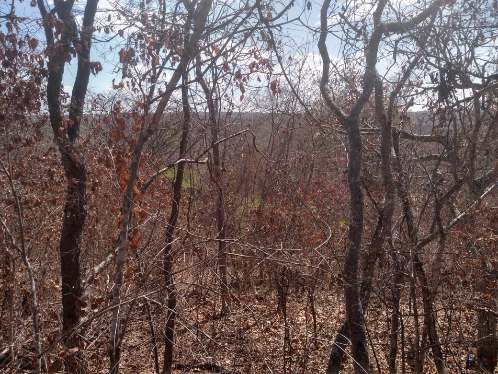
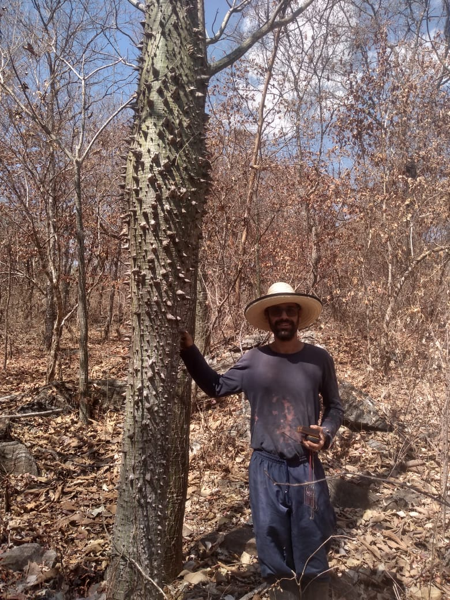
Da esquerda para a direita, respectivamente, imagem de: Sr Gerson (proprietário da área); MBC; André Giles

---
class: top, left

## Diferentes tipos de vegetação respondem de forma diferente às perturbações.


- Os diferentes tipos de vegetação possuem composição de espécies particulares e, portanto, características funcionais diferentes;


- Por possuirem características funcionais diferentes, também interagem com o ambiente de forma diferente.

```{r, echo = FALSE, fig.align='center', out.width="55%"}
knitr::include_graphics("https://beduka.com/blog/wp-content/uploads/2019/03/Qual-a-import%C3%A2ncia-dos-biomas-brasileiros.jpg")
```

*Tilman (2001); Charles-Dominique et al (2015); Yin et al (2014); Berdugo et al (2017); Staver et al (2020)*

---
class: top, left

# Produtividade primária como um proxy do funcionamento da vegetação

- Produção primária bruta é uma função básica para os ecossistemas e pode ser inferida por índices derivados de imagens de satélite *Biudes et al (2021)*.

```{r coisaseria, include = TRUE, echo = FALSE, out.width="60%", fig.align="center"}
knitr::include_graphics("img/biudes2021.png")
```

---
## CAPÍTULO I: 
### **Pergunta:** Mata seca, mata de galeria e savanas sob um mesmo regime de precipitação são estados alternativos funcionais? 

--
***

### **Hipótese:** São estados alternativos funcionais se: **(a)** forem funcionalmente diferentes e **(b)** se estiverem sob mesmas condições de solo e de disponibilidade de água.

.center[

]


---
class: top, left

# Métodos
*** Local do estudo***

- Diferentes tipos de vegetação coexistindo na mesma paisagem e sob o mesmo regime de chuvas.

```{r fig1, include=TRUE, echo=FALSE, out.width="85%", fig.align='center'}
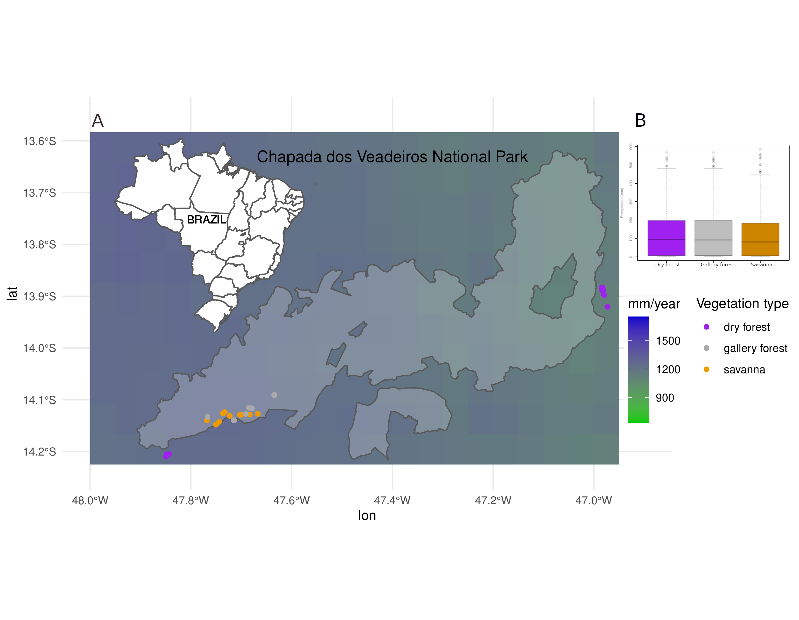
```

---
# Mapa interativo pra situar o PNCV

```{r out.width='80%', fig.height=6, eval=require('leaflet'), include=TRUE, echo=FALSE, fig.align='center'}
library(leaflet)
leaflet() %>% addTiles() %>% setView(-47.4, -14.0285, zoom = 9)
```

---

class: top, left

# Métodos

**Obtenção dos *Dados de campo***

- 10 parcelas em cada fitofisionomia (200 m² cada);

- Cobertura do dossel usando o densiômetro florestal côncavo;

- Coleta de solo.


---

class: top, left

# Métodos

**Obtenção dos *Dados remotos***

- [Landsat 8 OLI (Abril 2013 - Junho 2018)](https://earthexplorer.usgs.gov/)

-  [CHIRPS](https://data.chc.ucsb.edu/products/CHIRPS-2.0/).

```{r coisaseria2, include = TRUE, echo = FALSE, out.width="70%", fig.align="center"}
knitr::include_graphics("https://prd-wret.s3.us-west-2.amazonaws.com/assets/palladium/production/s3fs-public/styles/side_image/public/thumbnails/image/Landsat_8_%28LDCM%29_Satellite_over_Earth%2C%20Wiki%20Commons.jpg")
```

---
class: top, left

# Métodos

**Análises**

- Acoplamento = Correlação de Kendall entre chuva média mensal e EVI2 médio mensal; 

- Magnitude do acoplamento = valor absoluto do acoplamento (*sem o sinal*);

- Atraso (**lag**) na maior resposta (acoplamento máximo) da vegetação de zero a seis meses;

--

- PCA para reduzir variáveis do solo em duas dimensões;

--

- Regressão linear simples: acoplamento ~ atributos do solo/PC1;

--

- Teste de Kruskal-Wallis e teste a posteriori de Nemenyi para testar diferenças entre as fitofisionomias.

--

- Teste de Mann-Kendall para medir a tendência do EVI2 na estação seca.

---
class: top, left

# Resultados

**Comportamento do EVI2**

```{r fig3, include=TRUE, echo=FALSE, out.width="70%", fig.align='center'}
knitr::include_graphics("img/Figure_2.png")
```

---
class: top, left

# Resultados

**Acoplamento e atraso na resposta**

```{r fig4, include=TRUE, echo=FALSE, out.width="85%", fig.align='center'}
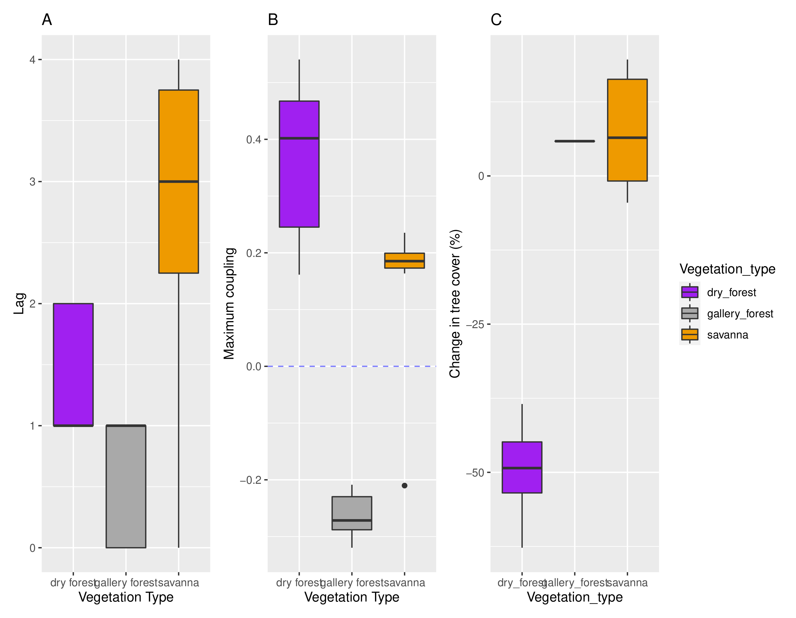
```

---
class: top, left

# Resultados

**Tendência na estação seca**

```{r fig1234567, include=TRUE, echo=FALSE, out.width="65%", fig.align='center'}
knitr::include_graphics("img/Figure_4_NOVA.png")
```
---
class: top, left

# Resultados

**Condições abióticas locais: solo**


```{r figSM6, include=TRUE, echo=FALSE, out.width="85%", fig.align='center'}
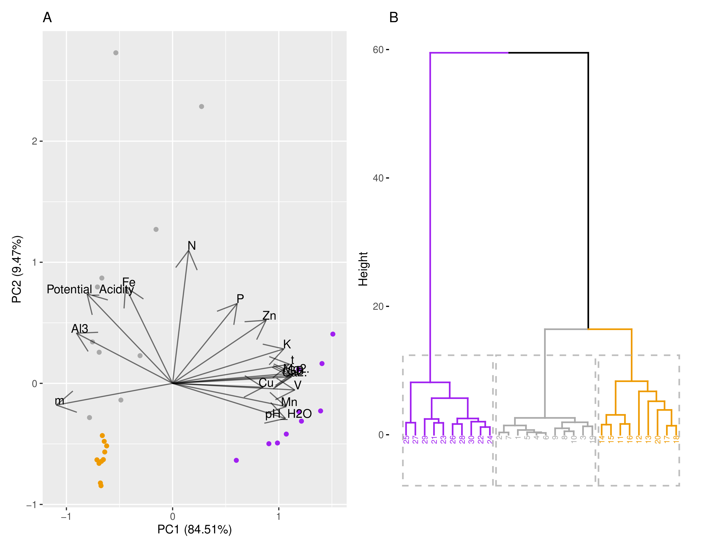
```

---
class: top, left
# Resultados

**Solo explica respostas**

```{r fig234345, include=TRUE, echo=FALSE, out.width="85%", fig.align='center'}
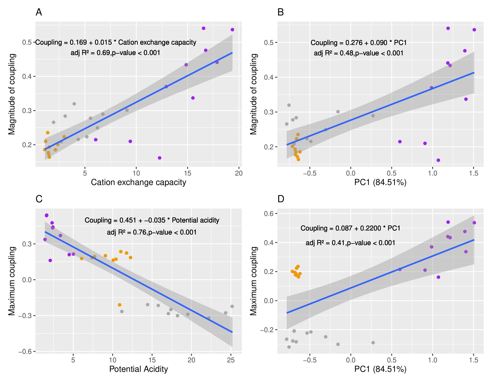
```

---
class: top, left
# Resultados

**Disponibilidade de água**

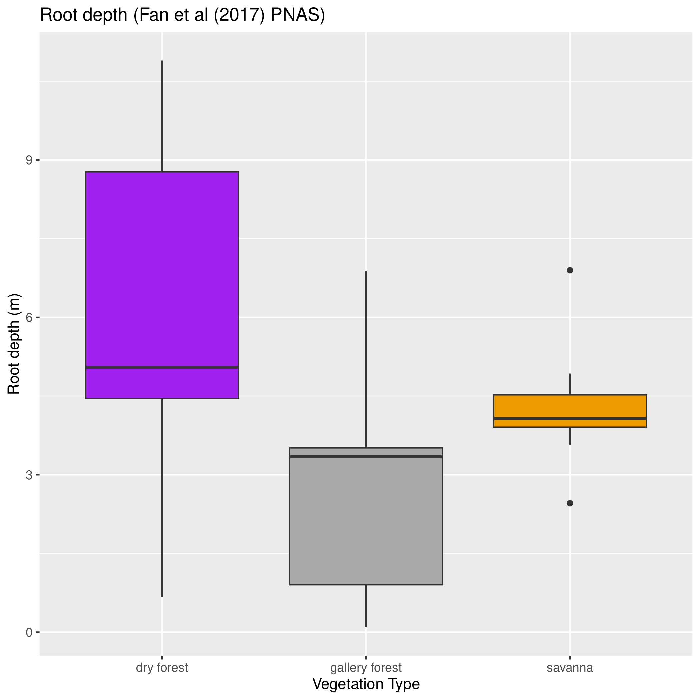
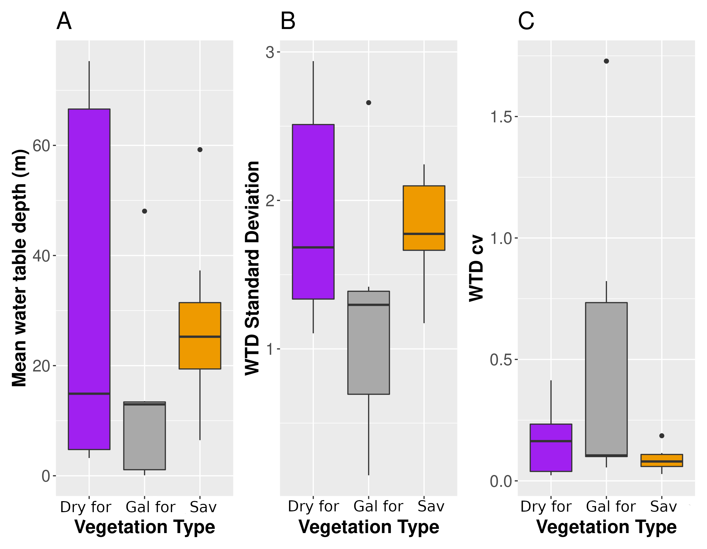


---
class: top, left
# Discussão

## Mata de galeria aumenta o greenness na estação seca;


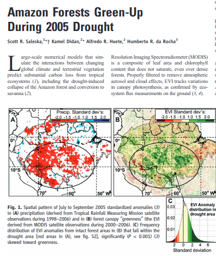    

---
class:top, center
.left[
# Discussão
]

### Algumas plantas são tolerantes ao alagamento

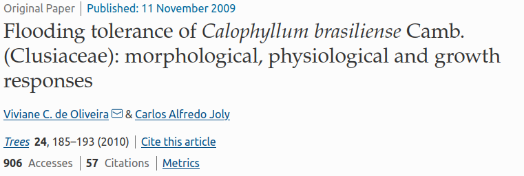
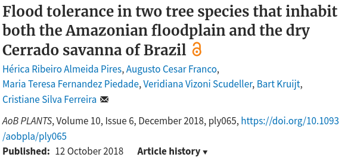 

--

### ...mas há limitações na estação chuvosa

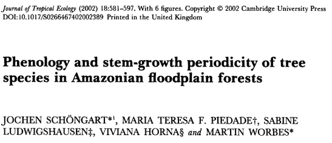
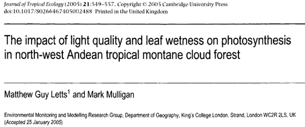
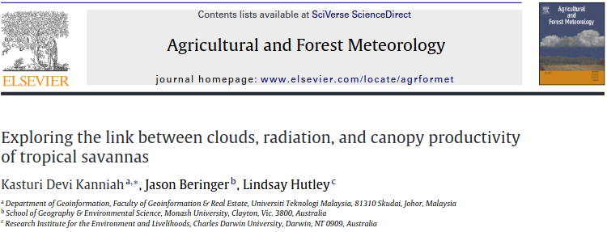

---
class: top, left
# Discussão

## Savanna não é sensível à diminuição da precipitação durante a estação seca;

- Diversidade de estratégias de resistência à seca;
- Acesso à água;
- Facilitação;

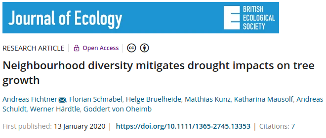
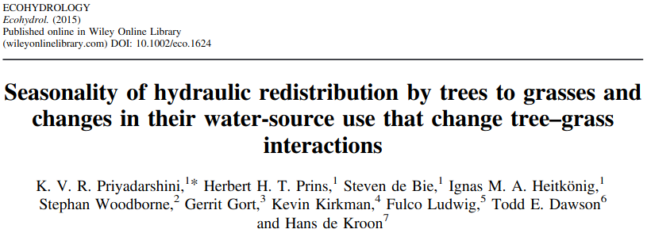
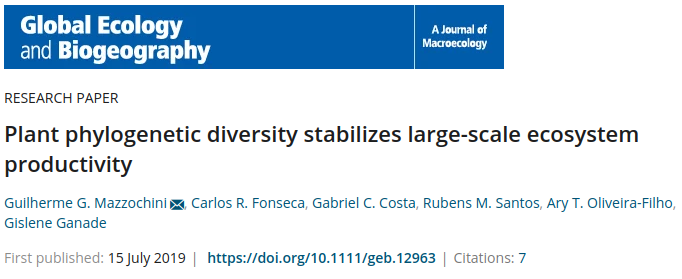

---

## Mata seca é mais responsiva que as outras vegetações.

- Estratégias diferentes permitem complementariedade de nicho;

- Deciduidade depende da fertilidade do solo;

- Ontogenia têm papel importante na estruturação da vegetação e nas respostas à seca.


---
class: top, left

# Discussão

## Implicações pra transição dos biomas: estabilidade e resiliência

- Quem pode avançar sobre quem?


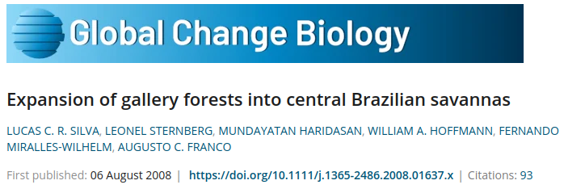
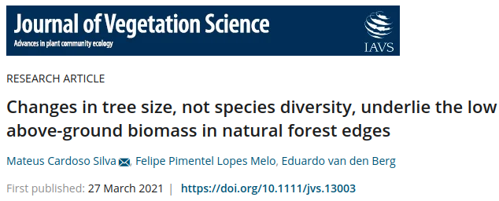

---
class: top, left
.center[
# Conclusão]
___

### 1. Tipos de vegetação são diferentes funcionalmente;

***

### 2. Mas não são estados alternativos funcionais na escala de paisagem, pois não estão nas mesmas condições de solo nem de disponibilidade de água.

```{r, include=TRUE, echo=FALSE, fig.align='center', out.width="80%"}
 knitr::include_graphics("img/chave alternative stable states.png")
```

---
class: top, left
##  __Tá, mas qual a novidade?__

## Novidade metodológica


### A funcionalidade não é medida por atributos funcionais e sim pela resposta à oscilações na chuva.

***

### Proxy de funcionalidade capta resposta da vegetação ao longo do tempo;

***

### Não há necessidade de se criar um gradiente de condições artificial ao se utilizar um gradiente espacial de alguma condição para representar sua variação no tempo.

***

## Contribuição ao arcabouço de conhecimento

### Mostramos que matas secas, matas de galeria e savanas são funcionalmente diferetes e que não são estados alternativos funcionais sob o mesmo regime de precipitação.

---
## Agradecimentos


****

# E a todos os coleguinhas que ajudaram em campo e em discussões no laboratório ou pela internet mesmo. =)

---
class: top, left

# Capítulo I

- Interação da vegetação com seu ambiente depende dos atributos funcionais;

- Estas interações vão determinar os mecanismos de feedback que dão autoorganização aos sistemas;

- Resiliência depende do balanço entre feedbacks positivos e feedbacks negativos.

***

### **Pergunta:** Qual a relação dos atributos funcionais da vegetação neotropical com os mechanismos de feedbacks que governam a dinâmica de florestas e savannas?
***
### **Hipótese:** Os atributos funcionais são fundamentais para entender a resiliência de florestas e savannas às mudanças graduais das condições ambientais e às perturbações pontuais.
---
class: top, left

# Capítulo III

- Há indícios de que Florestas e savannas submetidos à condições mais variáveis sejam mais resilientes (*Ciemer et al 2019 - Nature Geoscience*).


***

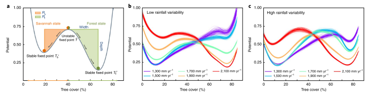

--

### **Pergunta:** As respostas fenológicas (acoplamento, sd do evi, média do evi, amplitude do evi) dos tipos de vegetação na escala continental dependem do regime de precipitação (MAP, MSI, cv) como a estrutura do dossel depende?
***
### **Hipótese:** As respostas dos diferentes tipos de vegetação mudam com mudanças no regime de precipitação.

