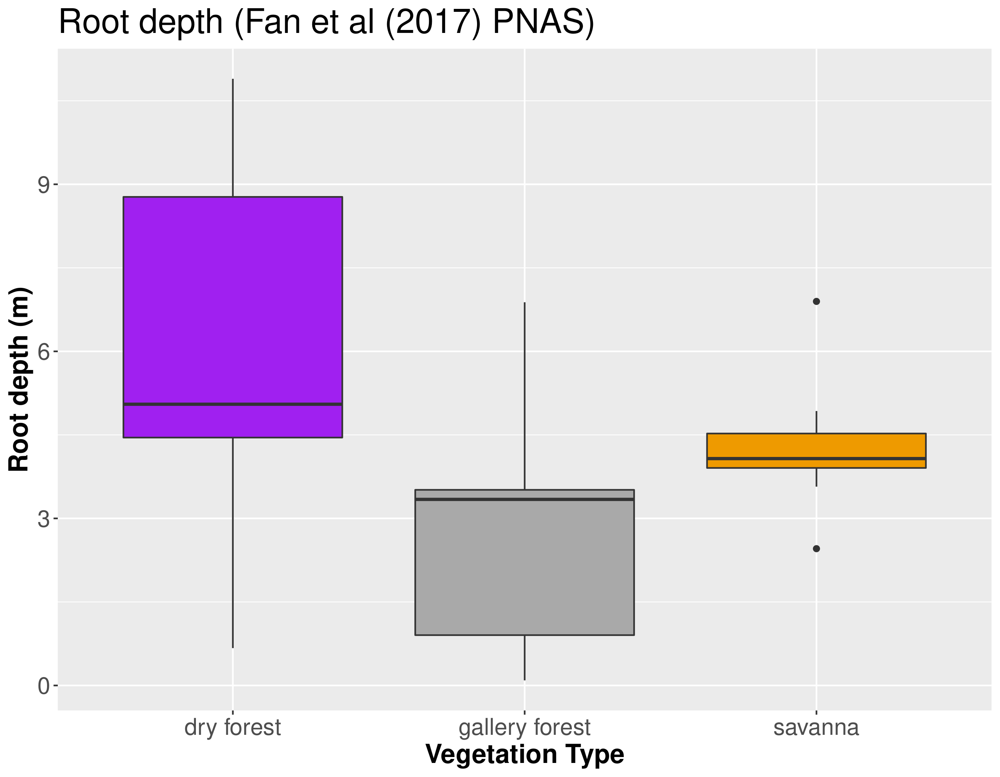

class: top, left

```{r xaringan-logo, echo=FALSE, include=TRUE}
xaringanExtra::use_logo(image_url = "https://ipes.ufsc.br/wp-content/themes/ipes-v1/images/logotipo.png")
```

```{r setup, include=FALSE}
options(htmltools.dir.version = FALSE)
```

```{r webcam, echo=FALSE, include= TRUE}
xaringanExtra::use_webcam()
```

```{r xaringan_themes, echo = FALSE, include=FALSE}
	names(xaringan:::list_css())
```

```{r broadcast, echo=FALSE}
xaringanExtra::use_broadcast()
```
# Estados alternativos funcionais, mecanismos de feedback e resiliência da vegetação tropical

- Funcionalidade da vegetação tropical face às mudanças globais.

- Conceito de resiliência ecológica (*Holling 1973 - Annual Review of Ecology and Systematics*)

- Variável de estado funcional e não estrutural.


.center[

]

---

## Savanas e Florestas na região tropical

- São estados alternativos em termos de estrutura da vegetação (cobertura do dossel) determinados parcialmente pela PMA (*Hirota et al 2011 - Science*). 

```{r figure1, include=TRUE, echo=FALSE, out.width="60%", fig.align='center', fig.pos='bottom', fig.cap="Hirota et al (2011) Science"}
knitr::include_graphics("img/hirota.jpg")
```
---
class: top, center

# Estrutura *vs*  funcionalidade

- Estudos sugerem que o funcionamento da vegetação seja correspondente à estrutura. (*Xu et al 2015; Xu et al 2016; Xu et al 2018.*)

- Presença de matas secas, além das matas de galeria sob as mesmas condições ambientais (*Dexter et al 2018*). 

.center[


]

--
### CAPÍTULO I: 
 Pergunta: Mata seca, mata de galeria e savanas sob um mesmo regime de precipitação são estados alternativos funcionais?

Hipótese: São estados alternativos funcionais se: **(a)** forem funcionalmente diferentes e **(b)** se estiverem sob mesmas condições de solo e de disponibilidade de água.

---
class: top, left

# Funcionalidade depende da amplitude de condições

- Há indícios de que Florestas e savannas submetidos à condições mais variáveis sejam mais resilientes (*Ciemer et al 2019 - Nature Geoscience*).

***


--

### Capítulo II

- Pergunta: As respostas fenológicas (acoplamento, sd do evi, média do evi, amplitude do evi) dos tipos de vegetação na escala continental dependem do regime de precipitação (MAP, MSI, cv) como a estrutura do dossel depende?

- Hipótese: As respostas dos diferentes tipos de vegetação mudam com mudanças no regime de precipitação.

---
class: top, left

# Resiliência depende dos atributos funcionais

- Funcionalidade e a resposta da vegetação à perturbações depende dos atributos funcionais selecionados para aquele regime específico de variação nas condições (*Barros et al 2019 - New Phytologist*).

- E que diferentes tipos de florestas com atributos diferentes podem possuir funcionamento diferente (*Dexter et al 2018 - Frontiers in Ecology and Evolution ; Christoffersen et al 2016 - Geoscientific Model Development*).

--

## Capítulo III


Pergunta: A resiliência de savanas e de matas de galeria ao fogo e à seca é determinada pela hidrologia, pela riqueza de espécies, pela média ou pela variação da comunidade nos atributos funcionais relacionados com resistência ao fogo e à seca?

Hipótese: Florestas alagadas são mais resilientes à eventos de seca, mas são menos resilientes ao fogo. A resiliência está relacionada com a variação de atributos funcionais da comunidade e não necesssariamente à riqueza de espécies.

---
class: top, left
# Capítulo I

## Sob o mesmo regime de precipitação

- __Savannas__ e __florestas__ dividem a mesma paisagem e sua distribuição é determinada pelo regime de fogo, disponibilidade de água e características do solo.

```{r, echo = FALSE, include=TRUE, fig.cap="Staal & Flores (2015) Biogeoscience", out.width="65%", fig.align='center'}

```

  *Ferreira et al (2007); Staver et al (2011); Dantas et al (2016); Veenendaal et al (2018); Pausas et al (2020)*

---

class: top, left

## Cerrado *stricto sensu*

- A cobertura do dossel varia de 5 a 60%

- Presença de gramíneas


                                    Fotos de MBC (2019)
                  

---
class: top, left

## Mata de Galeria


Fotos de MBC (2019)


---

## Mas não é só isso...

--

- Além das savannas e das florestas úmidas, também existem as matas secas. 

```{r figure3567, include=TRUE, echo=FALSE, out.width="60%", fig.align='center', fig.pos='bottom', fig.cap="Dexter et al (2018) Front. Ecol. Evol."}

knitr::include_graphics("https://www.frontiersin.org/files/Articles/391790/fevo-06-00104-HTML-r1/image_m/fevo-06-00104-g001.jpg")

```

---
class: top, left

## Mata seca

- Vegetação relacionada com solos calcáreos com maior fertilidade.


Da esquerda para a direita, respectivamente, imagem de: Sr Gerson (proprietário da área); MBC; André Giles

---
class: top, left

## Diferentes tipos de vegetação respondem de forma diferente às perturbações.


- Os diferentes tipos de vegetação possuem composição de espécies particulares e, portanto, características funcionais diferentes;


- Por possuirem características funcionais diferentes, também interagem com o ambiente de forma diferente.

```{r, echo = FALSE, fig.align='center'}
knitr::include_graphics("https://beduka.com/blog/wp-content/uploads/2019/03/Qual-a-import%C3%A2ncia-dos-biomas-brasileiros.jpg")
```

*Charles-Dominique et al (2015); Yin et al (2014); Berdugo et al (2017); Staver et al (2020)*

---
class: top, left

# Produtividade primária como um proxy do funcionamento da vegetação

- Produção primária bruta é uma função básica para os ecossistemas e pode ser inferida por índices derivados de imagens de satélite *Biudes et al (2021)*.

```{r coisaseria, include = TRUE, echo = FALSE, out.width="60%", fig.align="center"}
knitr::include_graphics("img/biudes2021.png")
```

---
class: top, left

# Objetivo

- Testar se Cerrado stricto senso, matas de galeria e  matas secas sob um mesmo regime de precipitação são estados alternativos funcionais.

--


# Hipótese

- As fisionomias vegetais têm funcionamento diferente, mas só podem ser estados alternativos se ocorrerem nas mesmas condições locais ou se o seu funcionamento retroalimentar estas condições.

--

```{r, include=TRUE, echo=FALSE, fig.align='center', out.width="70%"}
 
```


---
class: top, left

# Métodos
*** Local do estudo***

- Diferentes tipos de vegetação coexistindo na mesma paisagem e sob o mesmo regime de chuvas.

```{r fig1, include=TRUE, echo=FALSE, out.width="85%", fig.align='center'}

```

---
# Mapa interativo pra situar o PNCV

```{r out.width='80%', fig.height=6, eval=require('leaflet'), include=TRUE, echo=FALSE, fig.align='center'}
library(leaflet)
leaflet() %>% addTiles() %>% setView(-47.4, -14.0285, zoom = 9)
```

---

class: top, left

# Métodos

**Obtenção dos *Dados de campo***

- 10 parcelas em cada fitofisionomia;

- cada uma com 200 m²;

- Coleta de solo.


---

class: top, left

# Métodos

**Obtenção dos *Dados remotos***

- [Landsat 8 OLI (Abril 2013 - Junho 2018)](https://earthexplorer.usgs.gov/)


-  [CHIRPS](https://data.chc.ucsb.edu/products/CHIRPS-2.0/).

```{r coisaseria2, include = TRUE, echo = FALSE, out.width="70%", fig.align="center"}
knitr::include_graphics("https://prd-wret.s3.us-west-2.amazonaws.com/assets/palladium/production/s3fs-public/styles/side_image/public/thumbnails/image/Landsat_8_%28LDCM%29_Satellite_over_Earth%2C%20Wiki%20Commons.jpg")
```

---
class: top, left

# Métodos

**Análises**

- Acoplamento = Correlação de Kendall entre chuva média mensal e EVI2 médio mensal; 

- Magnitude do acoplamento = valor absoluto do acoplamento (*sem o sinal*);

- Cálculo das respostas da vegetação (acoplamento) *com atraso* (**lag**) de zero a seis meses;

--

- PCA para reduzir variáveis do solo em duas dimensões;

--

- Regressão linear simples: Acoplamento ~ atributos do solo/PC1;

--

- Teste de Kruskal-Wallis e teste a posteriori de Nemenyi para testar diferenças entre as fitofisionomias.

--

- Teste de Mann-Kendall para medir a tendência do EVI2 na estação seca.

---
class: top, left

# Resultados

**Comportamento do EVI2**

```{r fig3, include=TRUE, echo=FALSE, out.width="70%", fig.align='center'}
knitr::include_graphics("img/Figure_2.png")
```

---
class: top, left

# Resultados

**Acoplamento e atraso na resposta**

```{r fig4, include=TRUE, echo=FALSE, out.width="85%", fig.align='center'}

```

---
class: top, left

# Resultados

**Tendência na estação seca**

```{r fig1234567, include=TRUE, echo=FALSE, out.width="65%", fig.align='center'}
knitr::include_graphics("img/Figure_4_NOVA.png")
```
---
class: top, left

# Resultados

**Condições abióticas locais: solo**


```{r figSM6, include=TRUE, echo=FALSE, out.width="85%", fig.align='center'}

```

---
class: top, left
# Resultados

**Solo explica respostas**

```{r fig234345, include=TRUE, echo=FALSE, out.width="85%", fig.align='center'}

```

---
class: top, left
# Resultados

**Disponibilidade de água**




--- 
class: top, left
# Discussão

## Mata de galeria aumenta o greenness na estação seca;


    

---
class:top, center

### Algumas plantas são tolerantes ao alagamento


 

--

### ...mas há limitações na estação chuvosa


---
class: top, left
# Discussão

## Savanna não é sensível à diminuição da precipitação durante a estação seca;

- Diversidade de estratégias de resistência à seca;
- Acesso à água;
- Facilitação;


---

## Mata seca passa mais sede que as outras vegetações.

- Estratégias diferentes permitem complementariedade de nicho;

- Deciduidade depende da fertilidade do solo;

- Ontogenia têm papel importante na estruturação da vegetação e nas respostas à seca.


---
class: top, left

# Discussão

## Implicações pra transição dos biomas: estabilidade e resiliência

- Quem pode avançar sobre quem?


---

class: top, center

# Conclusão

- Tipos de vegetação são diferentes funcionalmente;

- Mas não são estados alternativos funcionais na escala de paisagem, pois não estão nas mesmas condições de solo.


---
## Agradecimentos


****

- E a todos os coleguinhas que ajudaram em campo e em discussões no laboratório ou pela internet mesmo. =)

